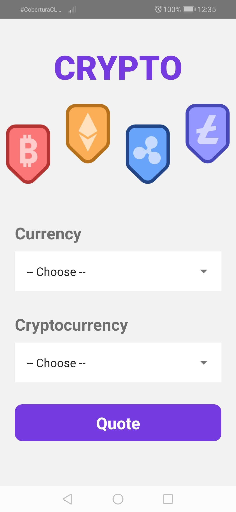
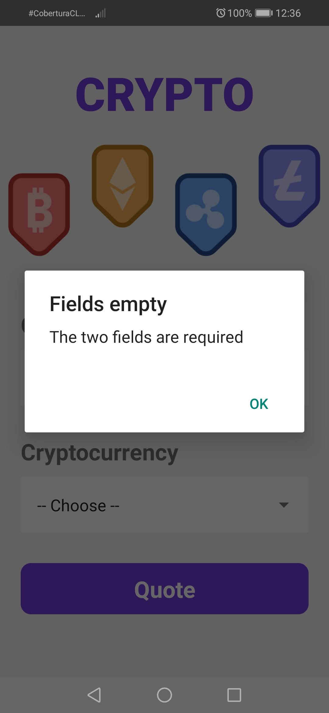
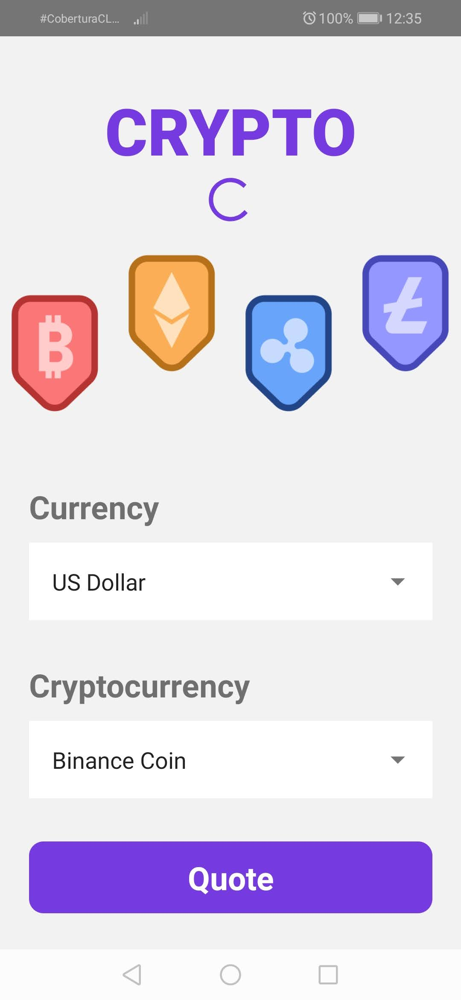
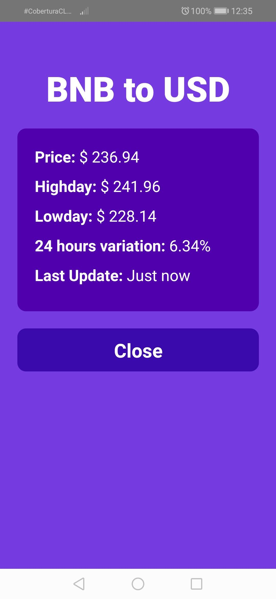

# Crypto-RN
This application was created with React Native technology, tested in the Android version.
### Functionality
- Search data from a certain currency in cryptocurrency.
- Validation of form fields in order to be able to do the comparison.
- CryptoCompare API used to be able to pick a cryptocurrency from the top 10.

## Installation
To install this project follow the next steps:
1.  Download the repository found here: [GitHub Repository](https://github.com/SuaferoanTJK/Crypto-RN)
2.  Run **npm install** script
3.  Run **npx react-native run-android** script to raise the development server.
4.  Watch the emergent emulator on your pc or your android cellphone (if the device is connected to the pc via USB and has developer mode enable).

## Screenshots

  
  
  
  

## Get in touch
### LinkedIn
https://www.linkedin.com/in/andrés-f-suárez/
